# HTML (HTML5 标准)

---

## 1. 介绍

超文本标记语言（英语：HyperText Markup Language，简称：HTML）是一种用于创建网页的标准标记语言。
您可以使用 HTML 来建立自己的 WEB 站点，HTML 运行在浏览器上，由浏览器来解析。
在本教程中，您将学习如何使用 HTML 来创建站点。

> 注意：对于中文网页需要使用 `<meta charset="utf-8"> `声明编码，否则会出现乱码。有些浏览器(如 360 浏览器)会设置 GBK 为默认编码，则你需要设置为 `<meta charset="gbk">`。

HTML 文档的后缀名:

> .html
> .htm

---

### 第一个程序：

> <!DOCTYPE html>
> <html>
> <head>
> <meta charset="utf-8">
> <title>菜鸟教程(runoob.com)</title>
> </head>
> <body>
> <h1>我的第一个标题</h1>
> <p>我的第一个段落。</p>

> </body>
> </html>

```html
<!DOCTYPE html>
<html>
  <head>
    <meta charset="utf-8" />
    <title>菜鸟教程(runoob.com)</title>
  </head>
  <body>
    <h1>我的第一个标题</h1>

    <p>我的第一个段落。</p>
  </body>
</html>
```

- `<!DOCTYPE html> `声明为 HTML5 文档
- `<html> `元素是 HTML 页面的根元素
- `<head> `元素包含了文档的元（meta）数据，如 `<meta charset="utf-8"> `定义网页编码格式为 utf-8。
- `<title> `元素描述了文档的标题
- `<body> `元素包含了可见的页面内容
- `<h1> `元素定义一个大标题
- `<p>` 元素定义一个段落\*

---


---

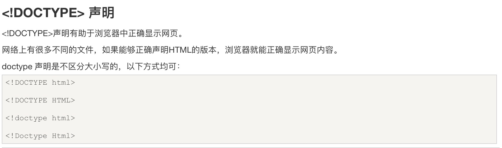

---

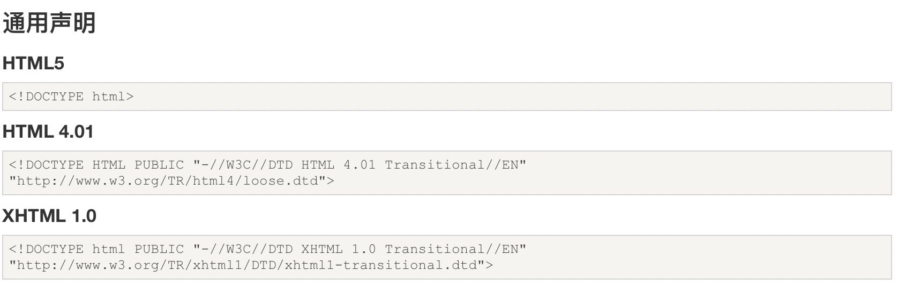

---

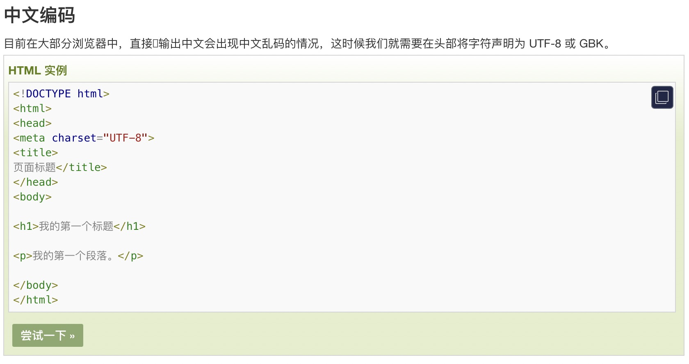

---

## 2. 基础

### HTML 标签

HTML 标题（Heading）是通过`<h1> - <h6> `标签来定义的。

> <h1>这是一个标题</h1>
> <h2>这是一个标题</h2>
> <h3>这是一个标题</h3>

```html
<h1>这是一个标题</h1>
<h2>这是一个标题</h2>
<h3>这是一个标题</h3>
```

---

### HTML 段落

HTML 段落是通过标签 `<p> `来定义的。

> <p>这是一个段落。</p>
> <p>这是另外一个段落。</p>

```html
<p>这是一个段落。</p>
<p>这是另外一个段落。</p>
```

---

### HTML 链接

HTML 链接是通过标签 `<a> `来定义的。

> <a href="https://www.runoob.com">这是一个链接-菜鸟教程</a>

```html
<a href="https://www.runoob.com">这是一个链接</a>
```

提示:在 href 属性中指定链接的地址。

---

### HTML 图像

HTML 图像是通过标签 ` `来定义的.

> 

```html

```

---

## 3. 元素

### HTML 元素

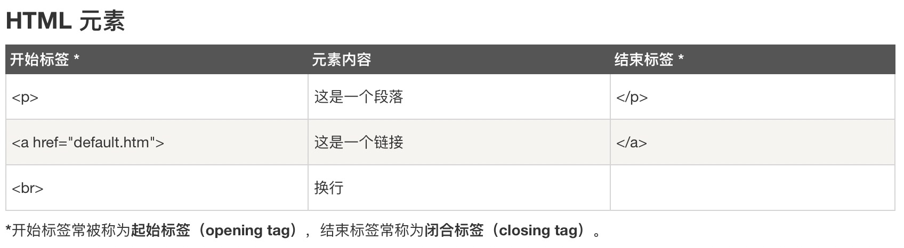

---

### HTML 元素语法

- HTML 元素以 **开始标签**起始
- HTML 元素以**结束标签**终止
- **元素的内容**是开始标签与结束标签之间的内容
- 某些 HTML 元素具有**空内容（empty content）**
- 空元素在**开始标签中进行关闭**（以开始标签的结束而结束）
- 大多数 HTML 元素可拥有**属性**

---

### 嵌套的 HTML 元素

大多数 HTML 元素可以嵌套（HTML 元素可以包含其他 HTML 元素）。
HTML 文档由相互嵌套的 HTML 元素构成。

---

### HTML 文档实例

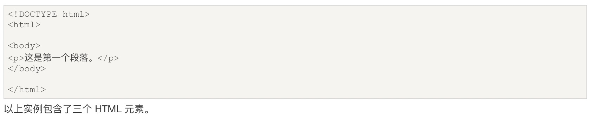

---

### HTML 实例解析

**`<p> `元素**:

```html
<p>这是第一个段落。</p>
```

这个 `<p> `元素定义了 HTML 文档中的一个段落。
这个元素拥有一个开始标签 `<p> `以及一个结束标签 `</p>`.
元素内容是: 这是第一个段落。

---

**`<body> `元素:**

```html
<body>
  <p>这是第一个段落。</p>
</body>
```

`<body> `元素定义了 HTML 文档的主体。
这个元素拥有一个开始标签 `<body> `以及一个结束标签 `</body> `。
元素内容是另一个 HTML 元素（p 元素）。

---

**`<html> `元素：**

```html
<html>
  <body>
    <p>这是第一个段落。</p>
  </body>
</html>
```

`<html> `元素定义了整个 HTML 文档。
这个元素拥有一个开始标签 `<html> `，以及一个结束标签 `</html> `.
元素内容是另一个 HTML 元素（body 元素）。

---

### HTML 空元素

没有内容的 HTML 元素被称为空元素。空元素是在开始标签中关闭的。
`<br> `就是没有关闭标签的空元素（`<br> `标签定义换行）。
在 XHTML、XML 以及未来版本的 HTML 中，所有元素都必须被关闭。
在开始标签中添加斜杠，比如 `<br />`，是关闭空元素的正确方法，HTML、XHTML 和 XML 都接受这种方式。
即使 `<br> `在所有浏览器中都是有效的，但使用 `<br /> `其实是更长远的保障。

---

### HTML 提示：使用小写标签

HTML 标签对大小写不敏感：`<P> `等同于 `<p>`。许多网站都使用大写的 HTML 标签。
菜鸟教程使用的是小写标签，因为万维网联盟（W3C）在 HTML 4 中推荐使用小写，而在未来 (X)HTML 版本中强制使用小写

---

## 4. 属性

### HTML 属性

- HTML 元素可以设置**属性**
- 属性可以在元素中添加**附加信息**
- 属性一般描述于**开始标签**
- 属性总是以名称/值对的形式出现，**比如：name="value"**。

---

### 属性实例

HTML 链接由 `<a> `标签定义。链接的地址在 **href 属性**中指定：

> <a href="http://www.runoob.com">这是一个链接</a>

```html
<a href="http://www.runoob.com">这是一个链接</a>
```

---

### HTML 属性常用引用属性值

属性值应该始终被包括在引号内。
双引号是最常用的，不过使用单引号也没有问题。
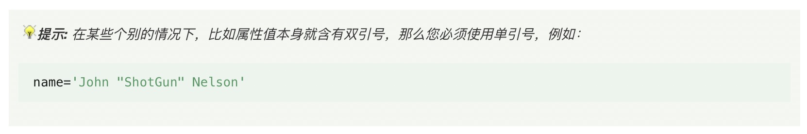

---

### HTML 提示：使用小写属性

属性和属性值对大小写不敏感。
不过，万维网联盟在其 HTML 4 推荐标准中推荐小写的属性/属性值。
而新版本的 (X)HTML 要求使用小写属性。

---

### HTML 属性参考手册

查看完整的 HTML 属性列表: [HTML 标签参考手册](https://www.runoob.com/tags/html-reference.html)。
下面列出了适用于大多数 HTML 元素的属性：
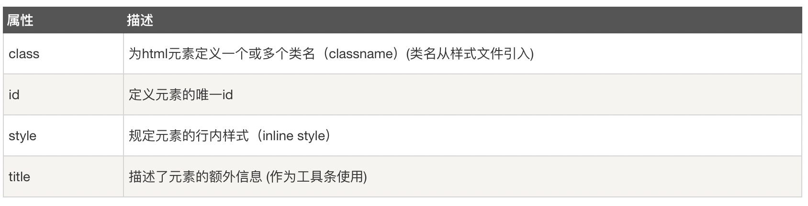
更多标准属性(全局属性)说明：[HTML 标准属性参考手册](https://www.runoob.com/tags/ref-standardattributes.html).

---

## 5. 标题

### HTML 标题

标题（Heading）是通过 `<h1> - <h6> `标签进行定义的。
`<h1> `定义最大的标题。 `<h6> `定义最小的标题。

```html
<h1>这是一个标题。</h1>
<h2>这是一个标题。</h2>
<h3>这是一个标题。</h3>
```

---

### HTML 水平线

`<hr> `标签在 HTML 页面中创建水平线。
hr 元素可用于分隔内容。
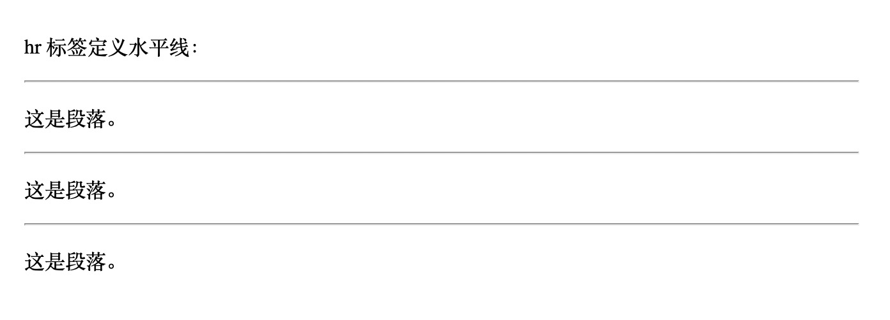

```html
<p>这是一个段落。</p>
<hr />
<p>这是一个段落。</p>
<hr />
<p>这是一个段落。</p>
```

---

### HTML 注释

可以将注释插入 HTML 代码中，这样可以提高其可读性，使代码更易被人理解。浏览器会忽略注释，也不会显示它们。
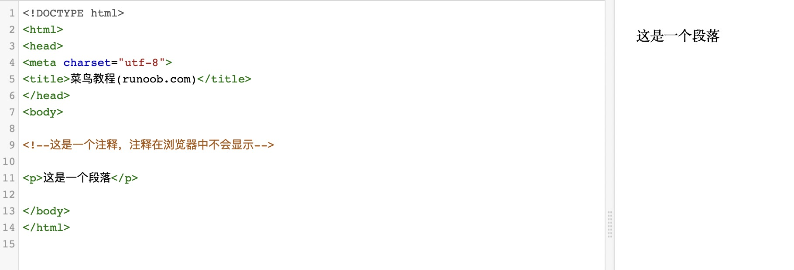

```html
<!-- 这是一个注释 -->
```

注释: 开始括号之后（左边的括号）需要紧跟一个叹号 ! (英文标点符号)，结束括号之前（右边的括号）不需要，合理地使用注释可以对未来的代码编辑工作产生帮助。

---

## 6. 段落

### HTML 段落

段落是通过 `<p> `标签定义的。
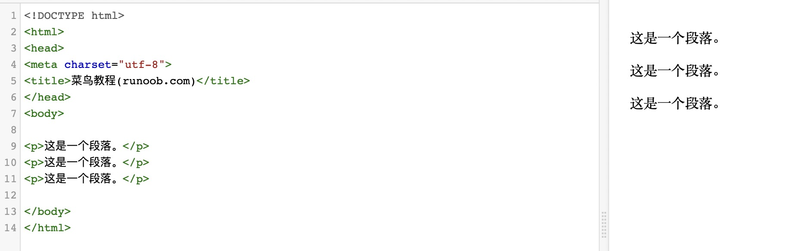

```html
<p>这是一个段落</p>
<p>这是另一个段落</p>
```

注意：浏览器会自动地在段落的前后添加空行。（`</p> `是块级元素）

---

### HTML 换行

如果您希望在不产生一个新段落的情况下进行换行（新行），请使用 `<br> `标签：
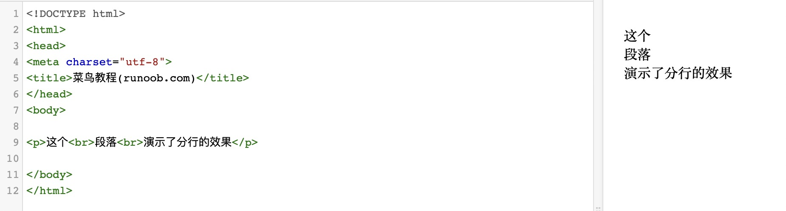

```html
<p>这个<br />段落<br />演示了分行的效果</p>
```

`<br /> `元素是一个空的 HTML 元素。由于关闭标签没有任何意义，因此它没有结束标签。

---

## 7. 文本格式化

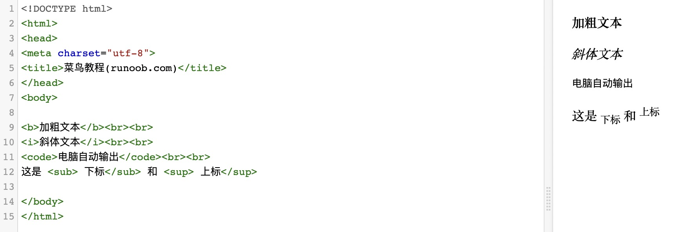

---

### HTML 格式化标签

HTML 使用标签 `<b>`("bold") 与 `<i>`("italic") 对输出的文本进行格式, 如：粗体 or 斜体
这些 HTML 标签被称为格式化标签（请查看底部完整标签参考手册）。

**通常标签 `<strong> `替换加粗标签 `<b> `来使用, `<em> `替换 `<i>`标签使用。**

然而，这些标签的含义是不同的：

`<b> `与`<i> `定义粗体或斜体文本。

`<strong> `或者 `<em>`意味着你要呈现的文本是重要的，所以要突出显示。现今所有主要浏览器都能渲染各种效果的字体。不过，未来浏览器可能会支持更好的渲染效果。

---

#### 文本格式化

此例演示如何在一个 HTML 文件中对文本进行格式化
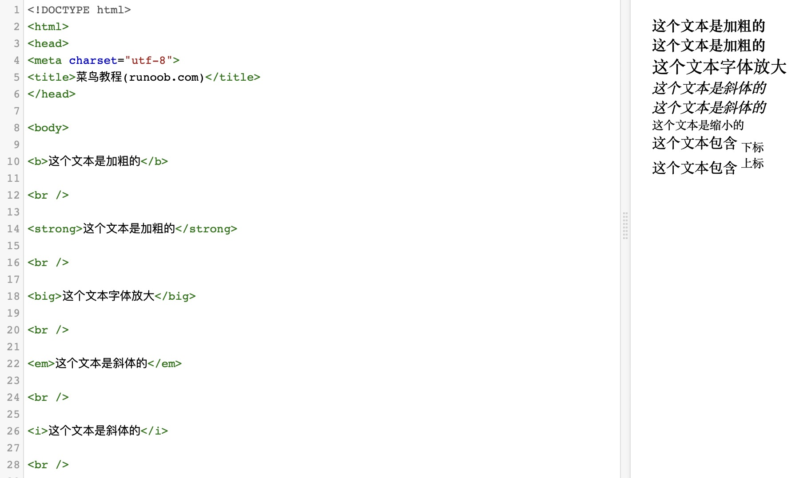
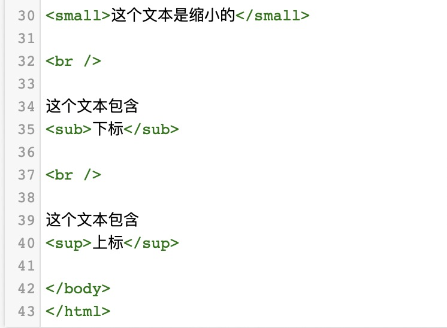

```html
<b>这个文本是加粗的</b>

<br />

<strong>这个文本是加粗的</strong>

<br />

<big>这个文本字体放大</big>

<br />

<em>这个文本是斜体的</em>

<br />

<i>这个文本是斜体的</i>

<br />

<small>这个文本是缩小的</small>

<br />

这个文本包含
<sub>下标</sub>

<br />

这个文本包含
<sup>上标</sup>
```

---

#### 预格式文本

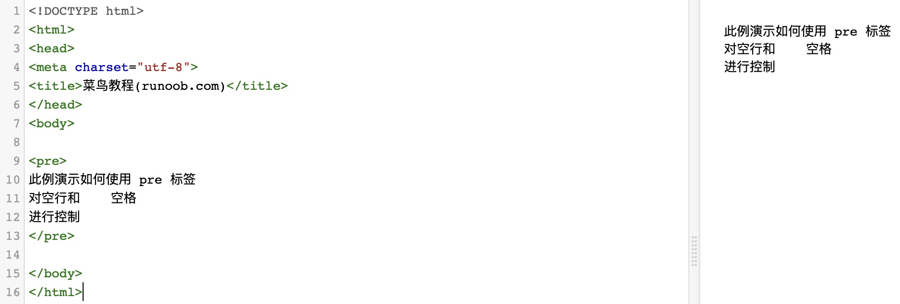

```html
<pre>
此例演示如何使用 pre 标签
对空行和    空格
进行控制
</pre>
```

---

#### '计算机输出'标签

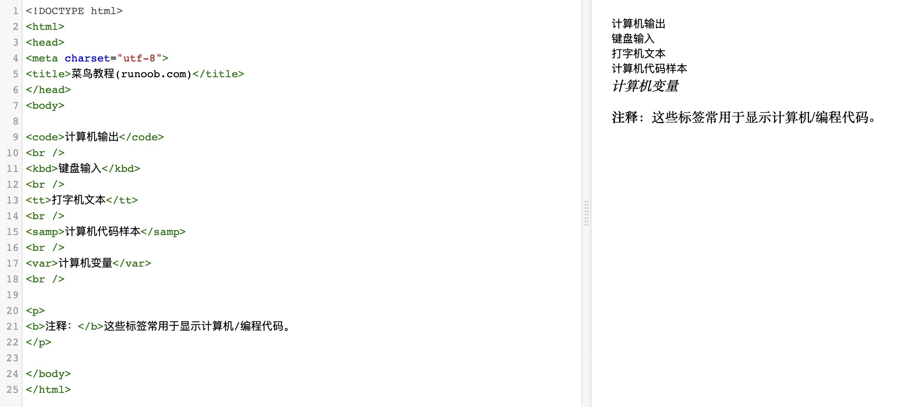

```html
<code>计算机输出</code>
<br />
<kbd>键盘输入</kbd>
<br />
<tt>打字机文本</tt>
<br />
<samp>计算机代码样本</samp>
<br />
<var>计算机变量</var>
<br />

<p><b>注释：</b>这些标签常用于显示计算机/编程代码。</p>
```

---

#### 地址

此例演示如何在 HTML 文件中写地址。
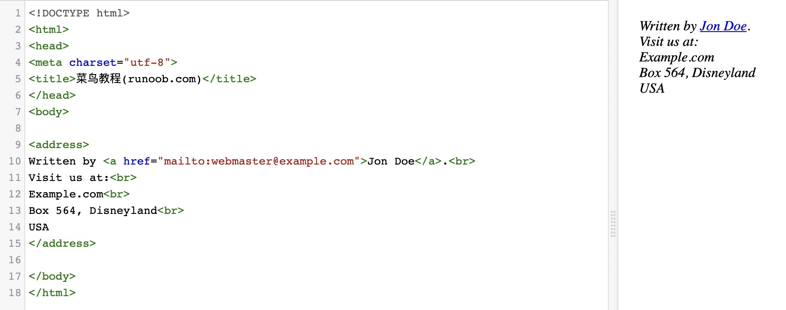

```html
<address>
  Written by <a href="mailto:webmaster@example.com">Jon Doe</a>.<br />
  Visit us at:<br />
  Example.com<br />
  Box 564, Disneyland<br />
  USA
</address>
```

---

#### 缩写和首字母缩写

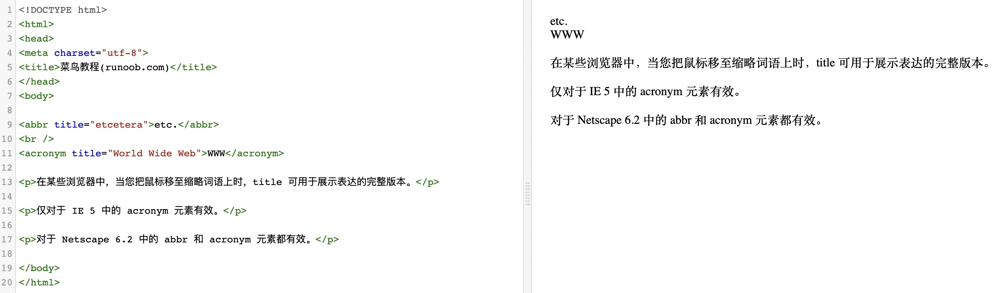

```html
<abbr title="etcetera">etc.</abbr>
<br />
<acronym title="World Wide Web">WWW</acronym>

<p>
  在某些浏览器中，当您把鼠标移至缩略词语上时，title 可用于展示表达的完整版本。
</p>

<p>仅对于 IE 5 中的 acronym 元素有效。</p>

<p>对于 Netscape 6.2 中的 abbr 和 acronym 元素都有效。</p>
```

---

#### 文字方向

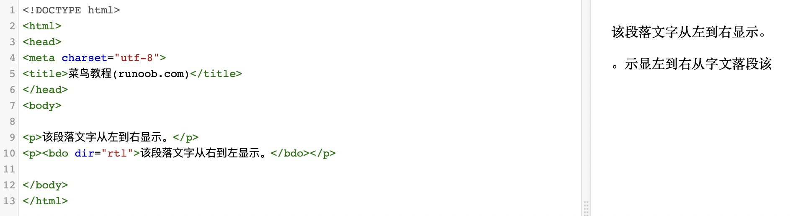

```html
<p>该段落文字从左到右显示。</p>
<p><bdo dir="rtl">该段落文字从右到左显示。</bdo></p>
```

---

#### 块引用

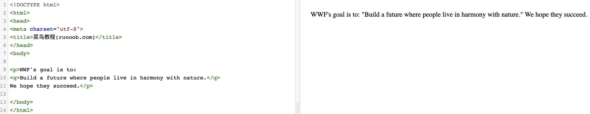

```html
<p>
  WWF's goal is to:
  <q>Build a future where people live in harmony with nature.</q>
  We hope they succeed.
</p>
```

---

#### 删除字效果和插入字效果

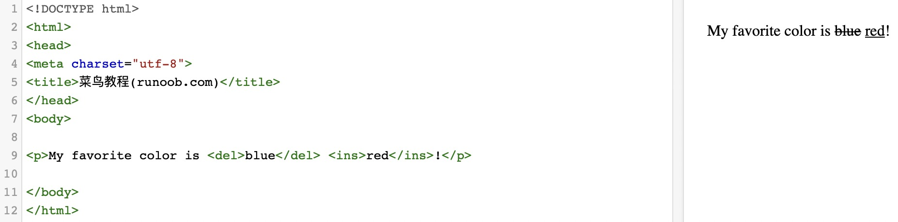

```html
<p>My favorite color is <del>blue</del> <ins>red</ins>!</p>
```

---

### HTML 文本格式化标签

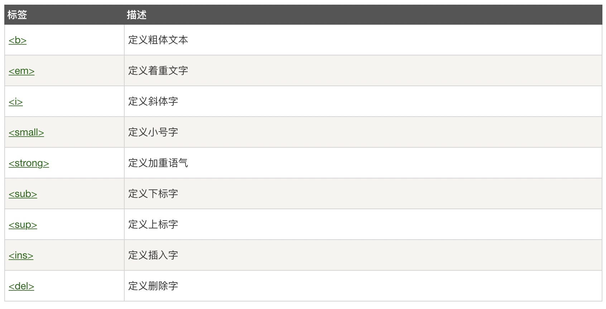

---

### HTML "计算机输出" 标签

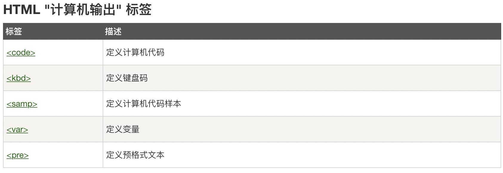

---

### HTML 引文, 引用, 及标签定义

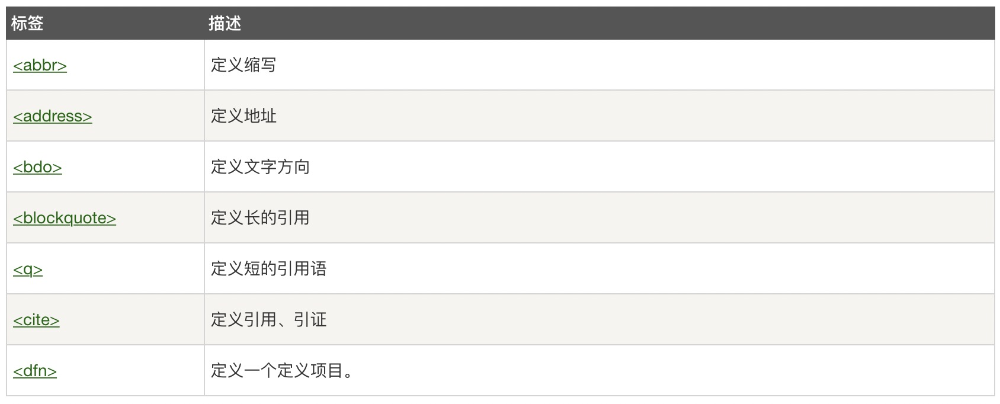

---

## 8. 链接

### HTML 链接
