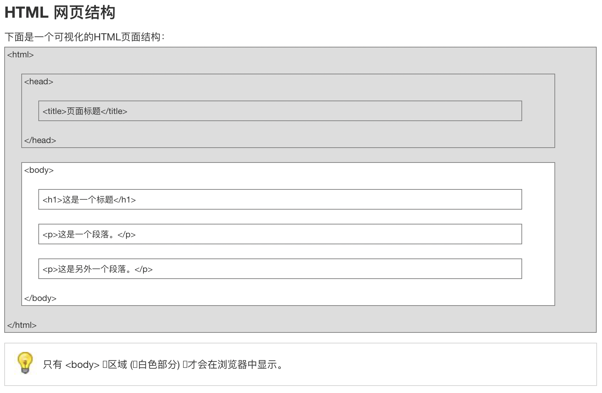
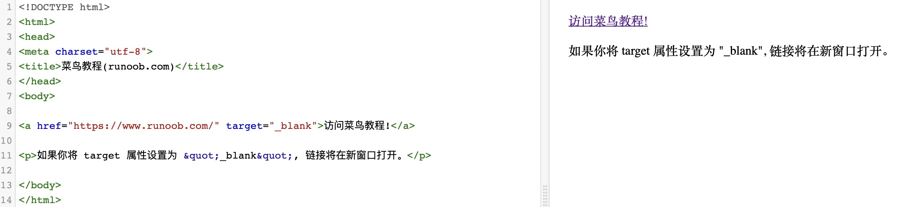

# HTML (HTML5 标准)

---

## 1. 介绍

超文本标记语言（英语：HyperText Markup Language，简称：HTML）是一种用于创建网页的标准标记语言。
您可以使用 HTML 来建立自己的 WEB 站点，HTML 运行在浏览器上，由浏览器来解析。
在本教程中，您将学习如何使用 HTML 来创建站点。

> 注意：对于中文网页需要使用 `<meta charset="utf-8"> `声明编码，否则会出现乱码。有些浏览器(如 360 浏览器)会设置 GBK 为默认编码，则你需要设置为 `<meta charset="gbk">`。

HTML 文档的后缀名:

> .html
> .htm

---

### 第一个程序：

> <!DOCTYPE html>
> <html>
> <head>
> <meta charset="utf-8">
> <title>菜鸟教程(runoob.com)</title>
> </head>
> <body>
> <h1>我的第一个标题</h1>
> <p>我的第一个段落。</p>

> </body>
> </html>

```html
<!DOCTYPE html>
<html>
  <head>
    <meta charset="utf-8" />
    <title>菜鸟教程(runoob.com)</title>
  </head>
  <body>
    <h1>我的第一个标题</h1>

    <p>我的第一个段落。</p>
  </body>
</html>
```

- `<!DOCTYPE html> `声明为 HTML5 文档
- `<html> `元素是 HTML 页面的根元素
- `<head> `元素包含了文档的元（meta）数据，如 `<meta charset="utf-8"> `定义网页编码格式为 utf-8。
- `<title> `元素描述了文档的标题
- `<body> `元素包含了可见的页面内容
- `<h1> `元素定义一个大标题
- `<p>` 元素定义一个段落\*

---



---


---


---


---

## 2. 基础

### HTML 标签

HTML 标题（Heading）是通过`<h1> - <h6> `标签来定义的。

> <h1>这是一个标题</h1>
> <h2>这是一个标题</h2>
> <h3>这是一个标题</h3>

```html
<h1>这是一个标题</h1>
<h2>这是一个标题</h2>
<h3>这是一个标题</h3>
```

---

### HTML 段落

HTML 段落是通过标签 `<p> `来定义的。

> <p>这是一个段落。</p>
> <p>这是另外一个段落。</p>

```html
<p>这是一个段落。</p>
<p>这是另外一个段落。</p>
```

---

### HTML 链接

HTML 链接是通过标签 `<a> `来定义的。

> <a href="https://www.runoob.com">这是一个链接-菜鸟教程</a>

```html
<a href="https://www.runoob.com">这是一个链接</a>
```

提示:在 href 属性中指定链接的地址。

---

### HTML 图像

HTML 图像是通过标签 ` `来定义的.

> 

```html

```

---

## 3. 元素

### HTML 元素


---

### HTML 元素语法

- HTML 元素以 **开始标签**起始
- HTML 元素以**结束标签**终止
- **元素的内容**是开始标签与结束标签之间的内容
- 某些 HTML 元素具有**空内容（empty content）**
- 空元素在**开始标签中进行关闭**（以开始标签的结束而结束）
- 大多数 HTML 元素可拥有**属性**

---

### 嵌套的 HTML 元素

大多数 HTML 元素可以嵌套（HTML 元素可以包含其他 HTML 元素）。
HTML 文档由相互嵌套的 HTML 元素构成。

---

### HTML 文档实例


---

### HTML 实例解析

**`<p> `元素**:

```html
<p>这是第一个段落。</p>
```

这个 `<p> `元素定义了 HTML 文档中的一个段落。
这个元素拥有一个开始标签 `<p> `以及一个结束标签 `</p>`.
元素内容是: 这是第一个段落。

---

**`<body> `元素:**

```html
<body>
  <p>这是第一个段落。</p>
</body>
```

`<body> `元素定义了 HTML 文档的主体。
这个元素拥有一个开始标签 `<body> `以及一个结束标签 `</body> `。
元素内容是另一个 HTML 元素（p 元素）。

---

**`<html> `元素：**

```html
<html>
  <body>
    <p>这是第一个段落。</p>
  </body>
</html>
```

`<html> `元素定义了整个 HTML 文档。
这个元素拥有一个开始标签 `<html> `，以及一个结束标签 `</html> `.
元素内容是另一个 HTML 元素（body 元素）。

---

### HTML 空元素

没有内容的 HTML 元素被称为空元素。空元素是在开始标签中关闭的。
`<br> `就是没有关闭标签的空元素（`<br> `标签定义换行）。
在 XHTML、XML 以及未来版本的 HTML 中，所有元素都必须被关闭。
在开始标签中添加斜杠，比如 `<br />`，是关闭空元素的正确方法，HTML、XHTML 和 XML 都接受这种方式。
即使 `<br> `在所有浏览器中都是有效的，但使用 `<br /> `其实是更长远的保障。

---

### HTML 提示：使用小写标签

HTML 标签对大小写不敏感：`<P> `等同于 `<p>`。许多网站都使用大写的 HTML 标签。
菜鸟教程使用的是小写标签，因为万维网联盟（W3C）在 HTML 4 中推荐使用小写，而在未来 (X)HTML 版本中强制使用小写

---

## 4. 属性

### HTML 属性

- HTML 元素可以设置**属性**
- 属性可以在元素中添加**附加信息**
- 属性一般描述于**开始标签**
- 属性总是以名称/值对的形式出现，**比如：name="value"**。

---

### 属性实例

HTML 链接由 `<a> `标签定义。链接的地址在 **href 属性**中指定：

> <a href="http://www.runoob.com">这是一个链接</a>

```html
<a href="http://www.runoob.com">这是一个链接</a>
```

---

### HTML 属性常用引用属性值

属性值应该始终被包括在引号内。
双引号是最常用的，不过使用单引号也没有问题。


---

### HTML 提示：使用小写属性

属性和属性值对大小写不敏感。
不过，万维网联盟在其 HTML 4 推荐标准中推荐小写的属性/属性值。
而新版本的 (X)HTML 要求使用小写属性。

---

### HTML 属性参考手册

查看完整的 HTML 属性列表: [HTML 标签参考手册](https://www.runoob.com/tags/html-reference.html)。
下面列出了适用于大多数 HTML 元素的属性：

更多标准属性(全局属性)说明：[HTML 标准属性参考手册](https://www.runoob.com/tags/ref-standardattributes.html).

---

## 5. 标题

### HTML 标题

标题（Heading）是通过 `<h1> - <h6> `标签进行定义的。
`<h1> `定义最大的标题。 `<h6> `定义最小的标题。

```html
<h1>这是一个标题。</h1>
<h2>这是一个标题。</h2>
<h3>这是一个标题。</h3>
```

---

### HTML 水平线

`<hr> `标签在 HTML 页面中创建水平线。
hr 元素可用于分隔内容。


```html
<p>这是一个段落。</p>
<hr />
<p>这是一个段落。</p>
<hr />
<p>这是一个段落。</p>
```

---

### HTML 注释

可以将注释插入 HTML 代码中，这样可以提高其可读性，使代码更易被人理解。浏览器会忽略注释，也不会显示它们。


```html
<!-- 这是一个注释 -->
```

注释: 开始括号之后（左边的括号）需要紧跟一个叹号 ! (英文标点符号)，结束括号之前（右边的括号）不需要，合理地使用注释可以对未来的代码编辑工作产生帮助。

---

## 6. 段落

### HTML 段落

段落是通过 `<p> `标签定义的。


```html
<p>这是一个段落</p>
<p>这是另一个段落</p>
```

注意：浏览器会自动地在段落的前后添加空行。（`</p> `是块级元素）

---

### HTML 换行

如果您希望在不产生一个新段落的情况下进行换行（新行），请使用 `<br> `标签：


```html
<p>这个<br />段落<br />演示了分行的效果</p>
```

`<br /> `元素是一个空的 HTML 元素。由于关闭标签没有任何意义，因此它没有结束标签。

---

## 7. 文本格式化


---

### HTML 格式化标签

HTML 使用标签 `<b>`("bold") 与 `<i>`("italic") 对输出的文本进行格式, 如：粗体 or 斜体
这些 HTML 标签被称为格式化标签（请查看底部完整标签参考手册）。

**通常标签 `<strong> `替换加粗标签 `<b> `来使用, `<em> `替换 `<i>`标签使用。**

然而，这些标签的含义是不同的：

`<b> `与`<i> `定义粗体或斜体文本。

`<strong> `或者 `<em>`意味着你要呈现的文本是重要的，所以要突出显示。现今所有主要浏览器都能渲染各种效果的字体。不过，未来浏览器可能会支持更好的渲染效果。

---

#### 文本格式化

此例演示如何在一个 HTML 文件中对文本进行格式化


```html
<b>这个文本是加粗的</b>

<br />

<strong>这个文本是加粗的</strong>

<br />

<big>这个文本字体放大</big>

<br />

<em>这个文本是斜体的</em>

<br />

<i>这个文本是斜体的</i>

<br />

<small>这个文本是缩小的</small>

<br />

这个文本包含
<sub>下标</sub>

<br />

这个文本包含
<sup>上标</sup>
```

---

#### 预格式文本

此例演示如何使用 pre 标签对空行和空格进行控制。


```html
<pre>
此例演示如何使用 pre 标签
对空行和    空格
进行控制
</pre>
```

---

#### '计算机输出'标签

此例演示不同的"计算机输出"标签的显示效果。


```html
<code>计算机输出</code>
<br />
<kbd>键盘输入</kbd>
<br />
<tt>打字机文本</tt>
<br />
<samp>计算机代码样本</samp>
<br />
<var>计算机变量</var>
<br />

<p><b>注释：</b>这些标签常用于显示计算机/编程代码。</p>
```

---

#### 地址

此例演示如何在 HTML 文件中写地址。


```html
<address>
  Written by <a href="mailto:webmaster@example.com">Jon Doe</a>.<br />
  Visit us at:<br />
  Example.com<br />
  Box 564, Disneyland<br />
  USA
</address>
```

---

#### 缩写和首字母缩写

此例演示如何实现缩写或首字母缩写。


```html
<abbr title="etcetera">etc.</abbr>
<br />
<acronym title="World Wide Web">WWW</acronym>

<p>
  在某些浏览器中，当您把鼠标移至缩略词语上时，title 可用于展示表达的完整版本。
</p>

<p>仅对于 IE 5 中的 acronym 元素有效。</p>

<p>对于 Netscape 6.2 中的 abbr 和 acronym 元素都有效。</p>
```

---

#### 文字方向

此例演示如何改变文字的方向。


```html
<p>该段落文字从左到右显示。</p>
<p><bdo dir="rtl">该段落文字从右到左显示。</bdo></p>
```

---

#### 块引用

此例演示如何实现长短不一的引用语。


```html
<p>
  WWF's goal is to:
  <q>Build a future where people live in harmony with nature.</q>
  We hope they succeed.
</p>
```

---

#### 删除字效果和插入字效果

此例演示如何标记删除文本和插入文本。


```html
<p>My favorite color is <del>blue</del> <ins>red</ins>!</p>
```

---

### HTML 文本格式化标签


---

### HTML "计算机输出" 标签


---

### HTML 引文, 引用, 及标签定义


---

## 8. 链接

### HTML 链接


```html
<p><a href="/index.html">本文本</a> 是一个指向本网站中的一个页面的链接。</p>

<p>
  <a href="http://www.microsoft.com/">本文本</a>
  是一个指向万维网上的页面的链接。
</p>
```

---

### HTML 超链接（链接）

HTML 使用标签 `<a>`来设置**超文本链接**。
超链接可以是一个字，一个词，或者一组词，也可以是一幅图像，您可以点击这些内容来跳转到新的文档或者当前文档中的某个部分。
当您把鼠标指针移动到网页中的某个链接上时，箭头会变为一只小手。
在标签`<a> `中使用了 href 属性来描述链接的地址。
默认情况下，链接将以以下形式出现在浏览器中：

- 一个未访问过的链接显示为蓝色字体并带有下划线。
- 访问过的链接显示为紫色并带有下划线。
- 点击链接时，链接显示为红色并带有下划线。

---

### HTML 链接语法

`<a href="url">链接文本</a>`
href 属性描述了链接的目标。
<a href="https://www.runoob.com/">访问菜鸟教程</a>

```html
<a href="https://www.runoob.com/">访问菜鸟教程</a>
```

---

### HTML 链接 - target 属性

使用 target 属性，你可以定义被链接的文档在何处显示。

```
target属性问题
target="_blank":在新窗口中浏览新的页面。
target="_self":在同一个窗口打开新的页面。
target="_parent":在父窗口中打开新的页面。（页面中使用框架才有用）
target="_top" :以整个浏览器作为窗口显示新页面。（突破了页面框架的限制）
```


<a href="https://www.runoob.com/" target="_blank" rel="noopener noreferrer">访问菜鸟教程!</a>

```html
<a href="https://www.runoob.com/" target="_blank" rel="noopener noreferrer"
  >访问菜鸟教程!</a
>
```

---

### HTML 链接- id 属性

id 属性可用于创建一个 HTML 文档书签。
提示: 书签不会以任何特殊方式显示，即在 HTML 页面中是不显示的，所以对于读者来说是隐藏的。

#### 实例

在 HTML 文档中插入 ID:
<a id="tips">有用的提示部分</a>

```html
<a id="tips">有用的提示部分</a>
```

在 HTML 文档中创建一个链接到"有用的提示部分(id="tips"）"：
<a href="#tips">访问有用的提示部分</a>

```html
<a href="#tips">访问有用的提示部分</a>
```

或者，从另一个页面创建一个链接到"有用的提示部分(id="tips"）"：
<a href="https://www.runoob.com/html/html-links.html#tips">
访问有用的提示部分</a>

```html
<a href="https://www.runoob.com/html/html-links.html#tips">
  访问有用的提示部分</a
>
```

---

### 基本的注意事项 - 有用的提示

注释： 请始终将正斜杠添加到子文件夹。假如这样书写链接：href="https://www.runoob.com/html"，就会向服务器产生两次 HTTP 请求。这是因为服务器会添加正斜杠到这个地址，然后创建一个新的请求，就像这样：href="https://www.runoob.com/html/"。

---

#### 图片链接

如何使用图片链接。


```html
<p>
  创建图片链接:
  <a href="http://www.runoob.com/html/html-tutorial.html">
    </a>
</p>

<p>
  无边框的图片链接:
  <a href="http://www.runoob.com/html/html-tutorial.html">
    </a>
</p>
```

---

#### 在当前页面链接到指定位置

如何使用书签


```html
<p>
  <a href="#C4">查看章节 4</a>
</p>

<h2>章节 1</h2>
<p>这边显示该章节的内容……</p>

<h2>章节 2</h2>
<p>这边显示该章节的内容……</p>

<h2>章节 3</h2>
<p>这边显示该章节的内容……</p>

<h2><a id="C4">章节 4</a></h2>
<p>这边显示该章节的内容……</p>

<h2>章节 5</h2>
<p>这边显示该章节的内容……</p>
```

---

#### 跳出框架

本例演示如何跳出框架，假如你的页面被固定在框架之内。


```html
<p>跳出框架?</p>
<a href="http://www.runoob.com/" target="_top">点击这里!</a>
```

---

#### 创建电子邮件链接

本例演示如何链接到一个邮件。（本例在安装邮件客户端程序后才能工作。）


```html
<p>
  这是一个电子邮件链接：
  <a href="mailto:someone@example.com?Subject=Hello%20again" target="_top">
    发送邮件</a
  >
</p>

<p><b>注意:</b> 单词之间空格使用 %20 代替，以确保浏览器可以正常显示文本。</p>
```

---

#### 创建电子邮件链接 2

本例演示更加复杂的邮件链接。


```html
<p>
  这是另一个电子邮件链接：
  <a
    href="mailto:someone@example.com?cc=someoneelse@example.com&bcc=andsomeoneelse@example.com&subject=Summer%20Party&body=You%20are%20invited%20to%20a%20big%20summer%20party!"
    target="_top"
    >发送邮件!</a
  >
</p>

<p><b>注意:</b> 单词之间的空格使用 %20 代替，以确保浏览器可以正常显示文本。</p>
```

---

#### 关于创建电子邮件链接时如何发送邮件内容

在进行邮件内容发送时，需要使用关键字：**mailto**
<a href="mailto:zhangrr601@163.com?subject=这是邮件的主题&body=这是邮件的内容" rel="nofollow">发送邮件</a>

```html
<a
  href="mailto:zhangrr601@163.com?subject=这是邮件的主题&body=这是邮件的内容"
  rel="nofollow"
  >发送邮件</a
>
```

这样会调启系统默认的邮件程序发送给 zhangrr601@163.com，并且收件人那里已经填上了我邮箱的地址。
关于创建电子邮件链接时如何进行抄送，密送.
在进行抄送时，需要使用关键字：cc
在进行密送时，需要使用关键字：bcc
<a href="mailto:zhangrr601@163.com?cc=someone@163.com&bcc=somebody@163.com" rel="nofollow">发送邮件</a>

```html
<a
  href="mailto:zhangrr601@163.com?cc=someone@163.com&bcc=somebody@163.com"
  rel="nofollow"
  >发送邮件</a
>
```


---

## 9. 头部

### HTML `<head>`

`<title> `- 定义了 HTML 文档的标题
使用 `<title> `标签定义 HTML 文档的标题


---

`<base> `- 定义了所有链接的 URL
使用 `<base> `定义页面中所有链接默认的链接目标地址。


---

`<meta> `- 提供了 HTML 文档的 meta 标记
使用 `<meta> `元素来描述 HTML 文档的描述，关键词，作者，字符集等。


---

### HTML `<head> `元素

`<head> `元素包含了所有的头部标签元素。在 `<head>`元素中你可以插入脚本（scripts）, 样式文件（CSS），及各种 meta 信息。
可以添加在头部区域的元素标签为: `<title>`, `<style>`, `<meta> `, `<link>`, `<script>`, `<noscript>` 和 `<base>`。

---

### HTML `<title> `元素

`<title> `标签定义了不同文档的标题。
`<title> `在 HTML/XHTML 文档中是必需的。
`<title> `元素:

- 定义了浏览器工具栏的标题
- 当网页添加到收藏夹时，显示在收藏夹中的标题
- 显示在搜索引擎结果页面的标题

**一个简单的 HTML 文档:**

```html
<!DOCTYPE html>
<html>
  <head>
    <meta charset="utf-8" />
    <title>文档标题</title>
  </head>

  <body>
    文档内容......
  </body>
</html>
```

---

### HTML `<base> `元素

`<base> `标签描述了基本的链接地址/链接目标，该标签作为 HTML 文档中所有的链接标签的默认链接:

```html
<head>
  <base href="http://www.runoob.com/images/" target="_blank" />
</head>
```

---

### HTML `<link> `元素

`<link> `标签定义了文档与外部资源之间的关系。
`<link> `标签通常用于链接到样式表:

```html
<head>
  <link rel="stylesheet" type="text/css" href="mystyle.css" />
</head>
```

---

### HTML `<style> `元素

`<style> `标签定义了 HTML 文档的样式文件引用地址.
在`<style> `元素中你也可以直接添加样式来渲染 HTML 文档:

```html
<head>
  <style type="text/css">
    body {
      background-color: yellow;
    }
    p {
      color: blue;
    }
  </style>
</head>
```

---

### HTML `<meta> `元素

meta 标签描述了一些基本的元数据。
`<meta> `标签提供了元数据.元数据也不显示在页面上，但会被浏览器解析。
META 元素通常用于指定网页的描述，关键词，文件的最后修改时间，作者，和其他元数据。
元数据可以使用于浏览器（如何显示内容或重新加载页面），搜索引擎（关键词），或其他 Web 服务。
`<meta> `一般放置于 `<head> `区域

#### `<meta> `标签- 使用实例

为搜索引擎定义关键词:

```html
<meta name="keywords" content="HTML, CSS, XML, XHTML, JavaScript" />
```

---

为网页定义描述内容:

```html
<meta name="description" content="免费 Web & 编程 教程" />
```

---

定义网页作者:

```html
<meta name="author" content="Runoob" />
```

---

每 30 秒钟刷新当前页面:

```html
<meta http-equiv="refresh" content="30" />
```

---

### HTML `<script> `元素

`<script>`标签用于加载脚本文件，如： JavaScript。
`<script> `元素在以后的章节中会详细描述。

---

### HTML head 元素


---

## 10. 样式- CSS

### HTML 样式- CSS

CSS (Cascading Style Sheets) 用于渲染 HTML 元素标签的样式。

---

#### HTML 使用样式

本例演示如何使用添加到 <head> 部分的样式信息对 HTML 进行格式化。


```html
<!DOCTYPE html>
<html>
  <head>
    <meta charset="utf-8" />
    <title>菜鸟教程(runoob.com)</title>
    <style type="text/css">
      h1 {
        color: red;
      }
      p {
        color: blue;
      }
    </style>
  </head>

  <body>
    <h1>这是一个标题</h1>
    <p>这是一个段落。</p>
  </body>
</html>
```

---

#### 本例演示如何使用样式属性做一个没有下划线的链接。

如何使用 style 属性制作一个没有下划线的链接。


```html
<!DOCTYPE html>
<html>
  <head>
    <meta charset="utf-8" />
    <title>菜鸟教程(runoob.com)</title>
  </head>
  <body>
    <a href="http://www.runoob.com/" style="text-decoration:none;"
      >访问 runoob.com!</a
    >
  </body>
</html>
```

---

#### 链接到一个外部样式表

本例演示如何 标签链接到一个外部样式表。


```html
<!DOCTYPE html>
<html>
  <head>
    <meta charset="utf-8" />
    <title>菜鸟教程(runoob.com)</title>
    <link rel="stylesheet" type="text/css" href="styles.css" />
  </head>

  <body>
    <h1>我使用了外部样式文件来格式化文本</h1>
    <p>我也是!</p>
  </body>
</html>
```

---

### 如何使用 CSS

CSS 是在 HTML 4 开始使用的,是为了更好的渲染 HTML 元素而引入的.
CSS 可以通过以下方式添加到 HTML 中:

- 内联样式- 在 HTML 元素中使用"style" 属性
- 内部样式表 -在 HTML 文档头部 `<head> `区域使用`<style> `元素 来包含 CSS
- 外部引用 - 使用外部 CSS 文件

最好的方式是通过外部引用 CSS 文件.

在本站的 HTML 教程中我们使用了内联 CSS 样式来介绍实例，这是为了简化的例子，也使得你能更容易在线编辑代码并在线运行实例。

---

### 内联样式

当特殊的样式需要应用到个别元素时，就可以使用内联样式。 使用内联样式的方法是在相关的标签中使用样式属性。样式属性可以包含任何 CSS 属性。以下实例显示出如何改变段落的颜色和左外边距。

<p style="color:blue;margin-left:20px;">这是一个段落。</p>
```html
<p style="color:blue;margin-left:20px;">这是一个段落。</p>
```

---

### HTML 样式实例 - 背景颜色

背景色属性（background-color）定义一个元素的背景颜色：

<body style="background-color:yellow;">
<h2 style="background-color:red;">这是一个标题</h2>
<p style="background-color:green;">这是一个段落。</p>
</body>
```html
<body style="background-color:yellow;">
<h2 style="background-color:red;">这是一个标题</h2>
<p style="background-color:green;">这是一个段落。</p>
</body>
```

---

### HTML 样式实例 - 字体, 字体颜色 ，字体大小

我们可以使用 font-family（字体），color（颜色），和 font-size（字体大小）属性来定义字体的样式:

<h1 style="font-family:verdana;">一个标题</h1>
<p style="font-family:arial;color:red;font-size:20px;">一个段落。</p>
```html
<h1 style="font-family:verdana;">一个标题</h1>
<p style="font-family:arial;color:red;font-size:20px;">一个段落。</p>
```
现在通常使用font-family（字体），color（颜色），和font-size（字体大小）属性来定义文本样式，而不是使用` <font> `标签。

---

### HTML 样式实例 - 文本对齐方式

使用 text-align（文字对齐）属性指定文本的水平与垂直对齐方式：

<h1 style="text-align:center;">居中对齐的标题</h1>
<p>这是一个段落。</p>
```html
<h1 style="text-align:center;">居中对齐的标题</h1>
<p>这是一个段落。</p>
```
文本对齐属性 text-align取代了旧标签 `<center> `。

---

### 内部样式表

当单个文件需要特别样式时，就可以使用内部样式表。你可以在`<head> `部分通过 `<style>`标签定义内部样式表:

```html
<head>
  <style type="text/css">
    body {
      background-color: yellow;
    }
    p {
      color: blue;
    }
  </style>
</head>
```

---

### 外部样式表

当样式需要被应用到很多页面的时候，外部样式表将是理想的选择。使用外部样式表，你就可以通过更改一个文件来改变整个站点的外观。

```html
<head>
  <link rel="stylesheet" type="text/css" href="mystyle.css" />
</head>
```

---

### HTML 样式标签


---

## 11. 图像

### HTML 图像
